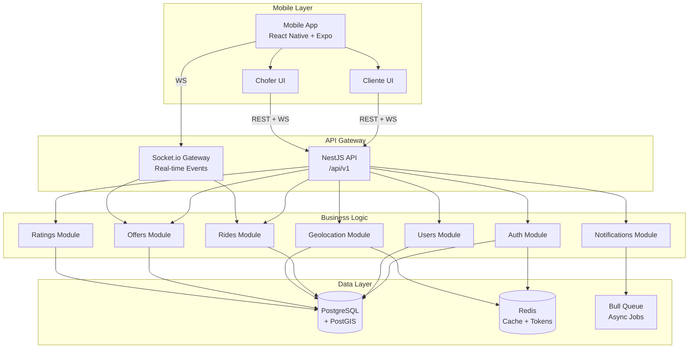
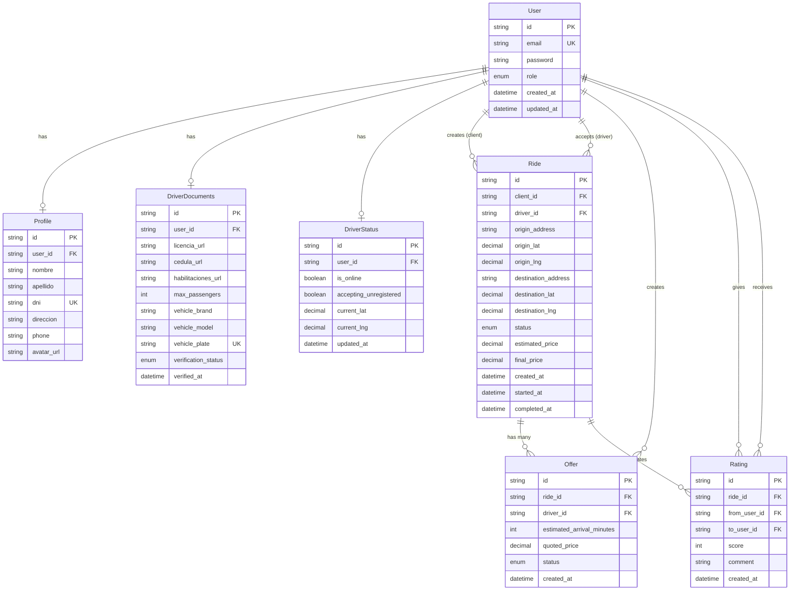
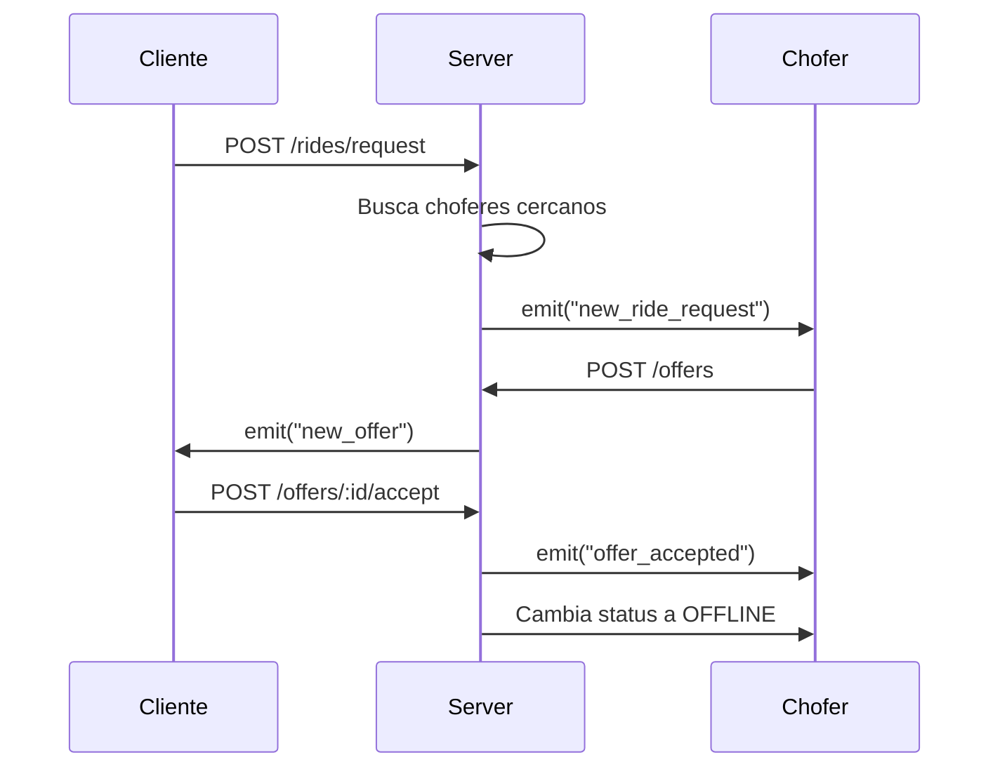
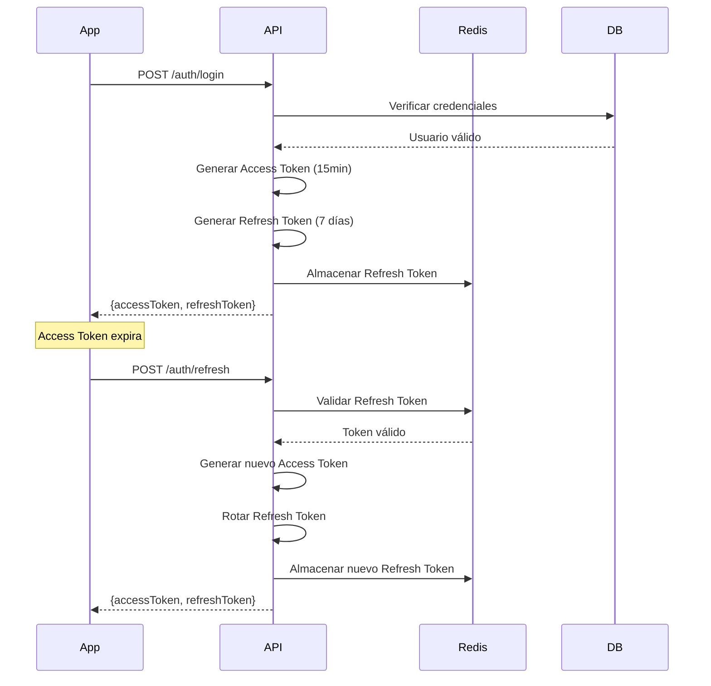
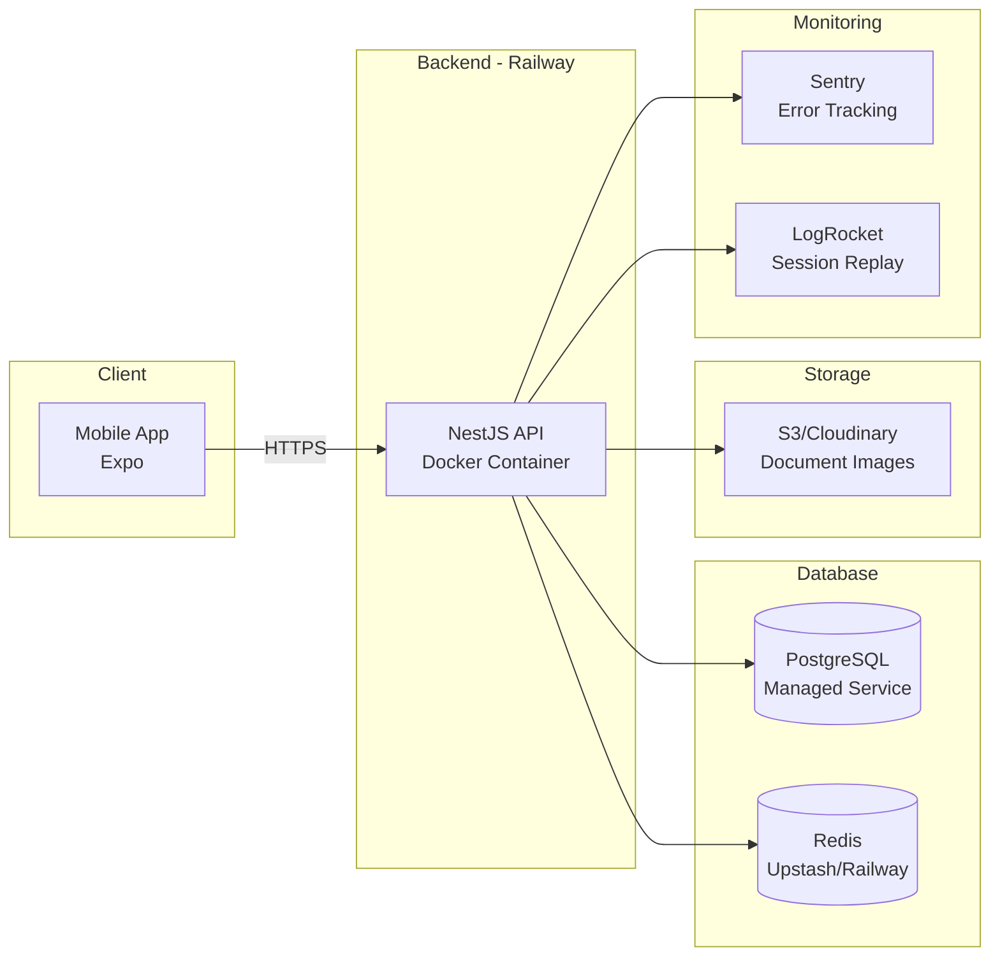

# 🏗️ REMIS APP - Technical Architecture

## System Architecture Overview



---

## Database Schema (Prisma)

### Complete ERD



### Prisma Schema

```prisma
// prisma/schema.prisma

generator client {
  provider = "prisma-client-js"
}

datasource db {
  provider = "postgresql"
  url      = env("DATABASE_URL")
}

enum UserRole {
  CLIENTE
  CHOFER
}

enum VerificationStatus {
  PENDING
  APPROVED
  REJECTED
}

enum RideStatus {
  PENDING
  MATCHED
  IN_PROGRESS
  COMPLETED
  CANCELLED
}

enum OfferStatus {
  PENDING
  ACCEPTED
  REJECTED
}

model User {
  id            String   @id @default(uuid())
  email         String   @unique
  password      String
  role          UserRole
  createdAt     DateTime @default(now()) @map("created_at")
  updatedAt     DateTime @updatedAt @map("updated_at")

  // Relations
  profile          Profile?
  driverDocuments  DriverDocuments?
  driverStatus     DriverStatus?
  ridesAsClient    Ride[]   @relation("ClientRides")
  ridesAsDriver    Ride[]   @relation("DriverRides")
  offers           Offer[]
  ratingsGiven     Rating[] @relation("RatingsGiven")
  ratingsReceived  Rating[] @relation("RatingsReceived")

  @@map("users")
}

model Profile {
  id        String  @id @default(uuid())
  userId    String  @unique @map("user_id")
  nombre    String
  apellido  String
  dni       String  @unique
  direccion String?
  phone     String?
  avatarUrl String? @map("avatar_url")

  user User @relation(fields: [userId], references: [id], onDelete: Cascade)

  @@map("profiles")
}

model DriverDocuments {
  id                  String             @id @default(uuid())
  userId              String             @unique @map("user_id")
  licenciaUrl         String             @map("licencia_url")
  cedulaUrl           String             @map("cedula_url")
  habilitacionesUrl   String             @map("habilitaciones_url")
  maxPassengers       Int                @map("max_passengers")
  vehicleBrand        String             @map("vehicle_brand")
  vehicleModel        String             @map("vehicle_model")
  vehiclePlate        String             @unique @map("vehicle_plate")
  verificationStatus  VerificationStatus @default(PENDING) @map("verification_status")
  verifiedAt          DateTime?          @map("verified_at")

  user User @relation(fields: [userId], references: [id], onDelete: Cascade)

  @@map("driver_documents")
}

model DriverStatus {
  id                    String    @id @default(uuid())
  userId                String    @unique @map("user_id")
  isOnline              Boolean   @default(false) @map("is_online")
  acceptingUnregistered Boolean   @default(true) @map("accepting_unregistered")
  currentLat            Decimal?  @map("current_lat") @db.Decimal(10, 8)
  currentLng            Decimal?  @map("current_lng") @db.Decimal(11, 8)
  updatedAt             DateTime  @updatedAt @map("updated_at")

  user User @relation(fields: [userId], references: [id], onDelete: Cascade)

  @@map("driver_status")
  @@index([currentLat, currentLng], type: Gist) // PostGIS spatial index
}

model Ride {
  id                  String      @id @default(uuid())
  clientId            String      @map("client_id")
  driverId            String?     @map("driver_id")
  originAddress       String      @map("origin_address")
  originLat           Decimal     @map("origin_lat") @db.Decimal(10, 8)
  originLng           Decimal     @map("origin_lng") @db.Decimal(11, 8)
  destinationAddress  String      @map("destination_address")
  destinationLat      Decimal     @map("destination_lat") @db.Decimal(10, 8)
  destinationLng      Decimal     @map("destination_lng") @db.Decimal(11, 8)
  status              RideStatus  @default(PENDING)
  estimatedPrice      Decimal?    @map("estimated_price") @db.Decimal(10, 2)
  finalPrice          Decimal?    @map("final_price") @db.Decimal(10, 2)
  createdAt           DateTime    @default(now()) @map("created_at")
  startedAt           DateTime?   @map("started_at")
  completedAt         DateTime?   @map("completed_at")

  client  User     @relation("ClientRides", fields: [clientId], references: [id])
  driver  User?    @relation("DriverRides", fields: [driverId], references: [id])
  offers  Offer[]
  ratings Rating[]

  @@map("rides")
  @@index([status, createdAt])
  @@index([clientId])
  @@index([driverId])
}

model Offer {
  id                      String      @id @default(uuid())
  rideId                  String      @map("ride_id")
  driverId                String      @map("driver_id")
  estimatedArrivalMinutes Int         @map("estimated_arrival_minutes")
  quotedPrice             Decimal     @map("quoted_price") @db.Decimal(10, 2)
  status                  OfferStatus @default(PENDING)
  createdAt               DateTime    @default(now()) @map("created_at")

  ride   Ride @relation(fields: [rideId], references: [id], onDelete: Cascade)
  driver User @relation(fields: [driverId], references: [id])

  @@map("offers")
  @@index([rideId, status])
  @@index([driverId])
}

model Rating {
  id         String   @id @default(uuid())
  rideId     String   @map("ride_id")
  fromUserId String   @map("from_user_id")
  toUserId   String   @map("to_user_id")
  score      Int      // 1-5
  comment    String?  @db.Text
  createdAt  DateTime @default(now()) @map("created_at")

  ride     Ride @relation(fields: [rideId], references: [id])
  fromUser User @relation("RatingsGiven", fields: [fromUserId], references: [id])
  toUser   User @relation("RatingsReceived", fields: [toUserId], references: [id])

  @@map("ratings")
  @@unique([rideId, fromUserId]) // Un usuario solo puede calificar una vez por viaje
  @@index([toUserId])
}
```

---

## Module Breakdown

### 1. Auth Module

**Responsabilidades:**

- Registro de usuarios (cliente/chofer)
- Login con JWT
- Refresh token management
- Logout (invalidación de refresh tokens)

**Endpoints:**

- `POST /api/v1/auth/register/client`
- `POST /api/v1/auth/register/driver`
- `POST /api/v1/auth/login`
- `POST /api/v1/auth/refresh`
- `POST /api/v1/auth/logout`

**Services:**

- `AuthService`: Lógica de autenticación
- `JwtService`: Generación y validación de tokens
- `RedisService`: Almacenamiento de refresh tokens

**Guards:**

- `JwtAuthGuard`: Verificación de access token
- `RolesGuard`: Verificación de rol (CLIENTE/CHOFER)

### 2. Users Module

**Responsabilidades:**

- Gestión de perfiles
- Upload y verificación de documentos (chofer)
- Consulta de usuarios

**Endpoints:**

- `GET /api/v1/users/me`
- `PATCH /api/v1/users/me`
- `GET /api/v1/users/:id`
- `POST /api/v1/drivers/documents`
- `GET /api/v1/drivers/documents/status`

**Services:**

- `UsersService`: CRUD de usuarios
- `FileUploadService`: Manejo de archivos
- `DocumentVerificationService`: Lógica de verificación

### 3. Geolocation Module

**Responsabilidades:**

- Update de ubicación en tiempo real
- Cálculo de distancias (PostGIS)
- Búsqueda de choferes cercanos

**Endpoints:**

- `PATCH /api/v1/drivers/location`
- `GET /api/v1/drivers/nearby`

**Services:**

- `GeolocationService`: Queries geoespaciales
- `DistanceCalculatorService`: Cálculos con PostGIS

### 4. Rides Module

**Responsabilidades:**

- Creación de solicitudes de viaje
- Matching de cliente-chofer
- Gestión de estados del viaje
- WebSocket para eventos real-time

**Endpoints:**

- `POST /api/v1/rides/request`
- `GET /api/v1/rides/:id`
- `PATCH /api/v1/rides/:id/start`
- `PATCH /api/v1/rides/:id/complete`
- `DELETE /api/v1/rides/:id` (cancelar)
- `GET /api/v1/rides/history`

**WebSocket Events:**

- Emit: `new_ride_request` (a choferes)
- Emit: `ride_status_changed` (a participantes)

**Services:**

- `RidesService`: CRUD y lógica de negocio
- `MatchingService`: Algoritmo de matching
- `RideCleanupService`: Job para limpiar rides huérfanos

### 5. Offers Module

**Responsabilidades:**

- Creación de ofertas por choferes
- Aceptación de ofertas por clientes
- WebSocket para ofertas en tiempo real

**Endpoints:**

- `POST /api/v1/offers`
- `GET /api/v1/rides/:rideId/offers`
- `POST /api/v1/offers/:id/accept`

**WebSocket Events:**

- Emit: `new_offer` (a cliente específico)
- Emit: `offer_accepted` (a chofer específico)

**Services:**

- `OffersService`: CRUD y lógica de ofertas

### 6. Ratings Module

**Responsabilidades:**

- Creación de calificaciones
- Cálculo de rating promedio
- Consulta de ratings de usuarios

**Endpoints:**

- `POST /api/v1/ratings`
- `GET /api/v1/users/:id/ratings`

**Services:**

- `RatingsService`: CRUD y cálculos

### 7. Notifications Module

**Responsabilidades:**

- Envío de push notifications
- Gestión de tokens de dispositivos
- Queue de notificaciones asíncronas

**Endpoints:**

- `POST /api/v1/notifications/register-token`
- `DELETE /api/v1/notifications/unregister-token`

**Services:**

- `NotificationsService`: Lógica de envío
- `ExpoNotificationsService`: Integración con Expo

---

## Real-Time Communication Flow

### Socket.io Configuration (Critical)

> [!IMPORTANT]
> Para asegurar la conexión con clientes móviles (React Native/Expo), se requiere la siguiente configuración en el backend:

1.  **IoAdapter:** Debe estar habilitado en `main.ts` (`app.useWebSocketAdapter(new IoAdapter(app))`).
2.  **Transports:** El Gateway debe permitir `['websocket', 'polling']` para compatibilidad.
3.  **Cors:** `credentials: true` y `origin: *` (o específico en prod).

### Socket.io Events

```typescript
// Server → Client Events
interface ServerToClientEvents {
  new_ride_request: (payload: {
    rideId: string;
    origin: string;
    destination: string;
    clientName: string;
    isClientRegistered: boolean;
    distance: number;
  }) => void;

  new_offer: (payload: {
    offerId: string;
    driverName: string;
    driverRating: number;
    estimatedArrival: number;
    quotedPrice: number;
  }) => void;

  offer_accepted: (payload: {
    rideId: string;
    clientName: string;
    origin: string;
    destination: string;
  }) => void;

  ride_status_changed: (payload: {
    rideId: string;
    newStatus: RideStatus;
  }) => void;
}

// Client → Server Events
interface ClientToServerEvents {
  join_driver_room: () => void;
  leave_driver_room: () => void;
  join_ride_room: (rideId: string) => void;
  leave_ride_room: (rideId: string) => void;
}
```

### WebSocket Flow Diagram



---

## Security Architecture

### Authentication Flow



### Authorization Layers

1. **JwtAuthGuard**: Valida access token en headers
2. **RolesGuard**: Verifica rol del usuario
3. **IsVerifiedGuard**: Verifica aprobación de documentos (solo choferes)
4. **OwnershipGuard**: Verifica que el usuario sea owner del recurso

---

## Performance Optimizations

### Caching Strategy (Redis)

```typescript
// Driver locations cache
Key: `driver:location:{userId}`
Value: { lat, lng, updated_at }
TTL: 60 seconds

// Driver online status
Key: `driver:online:{userId}`
Value: { is_online, accepting_unregistered }
TTL: indefinite (manual delete on offline)

// Refresh tokens
Key: `refresh_token:{userId}`
Value: { token, device_id, created_at }
TTL: 7 days

// Rate limiting
Key: `rate_limit:{ip}:{endpoint}`
Value: request_count
TTL: 60 seconds
```

### Database Indexes

```sql
-- Geospatial index for driver locations
CREATE INDEX idx_driver_status_location
ON driver_status
USING GIST (
  ST_SetSRID(ST_MakePoint(current_lng, current_lat), 4326)
);

-- Compound index for active rides
CREATE INDEX idx_rides_status_created
ON rides (status, created_at DESC);

-- Index for user ratings
CREATE INDEX idx_ratings_to_user
ON ratings (to_user_id);
```

---

## Deployment Architecture



---

## Technology Stack Summary

| Layer              | Technology          | Purpose                   | Local config |
| ------------------ | ------------------- | ------------------------- | ------------ |
| **Mobile**         | React Native + Expo | Cross-platform app        | Port 8081    |
| **Navigation**     | Expo Router         | File-based routing        | -            |
| **State (Server)** | TanStack Query      | Server state management   | -            |
| **State (Client)** | Zustand             | Client state management   | -            |
| **Real-time**      | Socket.io Client    | WebSocket communication   | v4.x         |
| **API**            | NestJS + TypeScript | Backend framework         | Port 3000    |
| **Database**       | PostgreSQL 16       | Primary data store        | Port 5433    |
| **Geospatial**     | PostGIS             | Geographic queries        | Enabled      |
| **Cache**          | Redis 7             | Caching + token storage   | Optional     |
| **ORM**            | Prisma              | Type-safe database access | v5.x         |
| **Auth**           | JWT + bcrypt        | Authentication            | -            |
| **File Upload**    | Multer + Local      | Document storage          | /uploads     |
| **Queue**          | Bull                | Async job processing      | -            |
| **Notifications**  | Expo Notifications  | Push notifications        | -            |
| **Deployment**     | Railway/Render      | Container hosting         | -            |
| **Monitoring**     | Sentry              | Error tracking            | -            |
