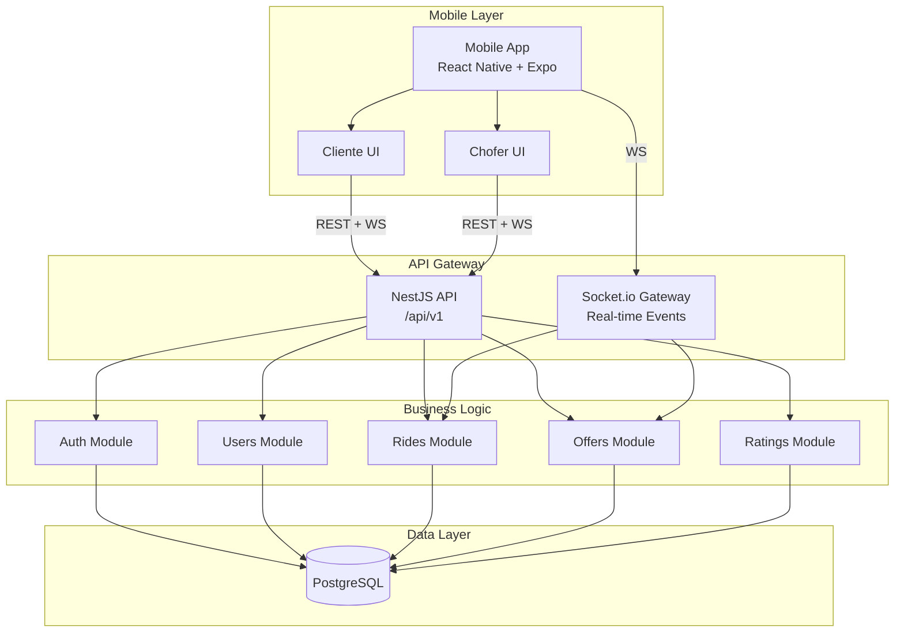
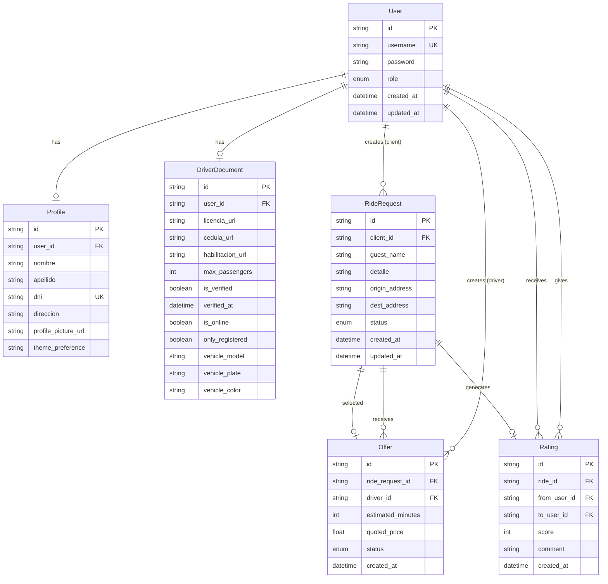
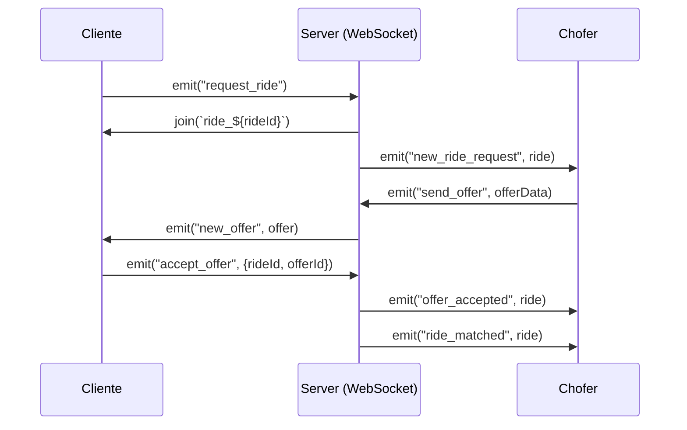
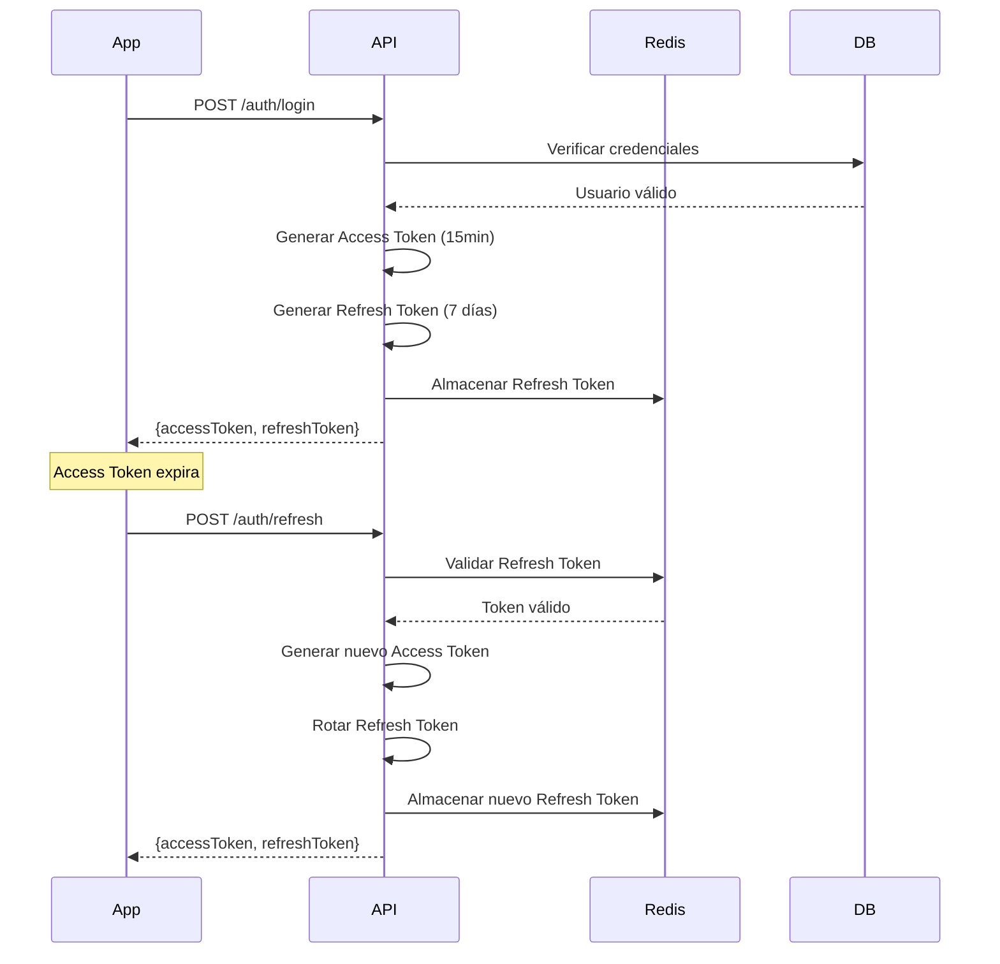
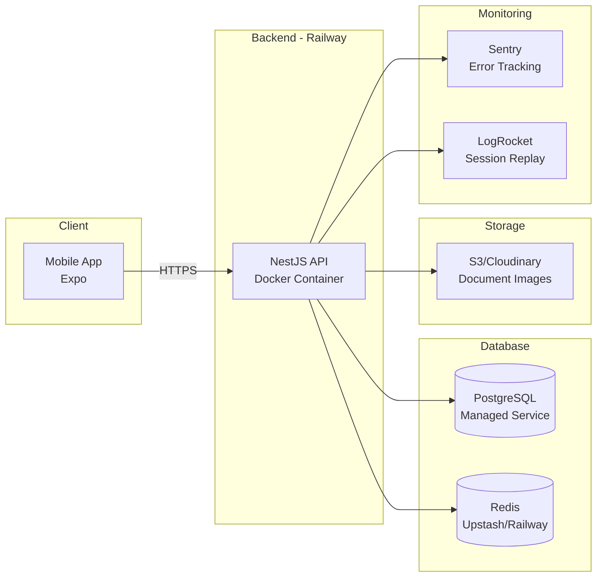

# 🏗️ REMIS APP - Technical Architecture

## System Architecture Overview



---

## Database Schema (Prisma)

### Complete ERD



### Prisma Schema

```prisma
// prisma/schema.prisma

generator client {
  provider = "prisma-client-js"
}

datasource db {
  provider = "postgresql"
  url      = env("DATABASE_URL")
}

enum Role {
  CLIENTE
  CHOFER
  ADMIN
}

enum RideStatus {
  PENDING
  MATCHED
  COMPLETED
  CANCELLED
}

enum OfferStatus {
  PENDING
  ACCEPTED
  DECLINED
  EXPIRED
}

model User {
  id        String   @id @default(uuid())
  username  String   @unique
  password  String
  role      Role
  createdAt DateTime @default(now())
  updatedAt DateTime @updatedAt

  profile          Profile?
  driverDocs       DriverDocument?
  ridesAsClient    RideRequest[]   @relation("ClientRides")
  offersAsDriver   Offer[]         @relation("DriverOffers")
  ratingsGiven     Rating[]        @relation("RaterRatings")
  ratingsReceived  Rating[]        @relation("RateeRatings")

  @@map("users")
}

model Profile {
  id        String  @id @default(uuid())
  userId    String  @unique
  user      User    @relation(fields: [userId], references: [id], onDelete: Cascade)

  nombre    String
  apellido  String
  dni               String  @unique
  direccion         String?
  profilePictureUrl String?
  themePreference   String  @default("EXECUTIVE")

  @@map("profiles")
}

model DriverDocument {
  id              String    @id @default(uuid())
  userId          String    @unique
  user            User      @relation(fields: [userId], references: [id], onDelete: Cascade)

  licenciaUrl     String?
  cedulaUrl       String?
  habilitacionUrl String?
  maxPassengers   Int?
  isVerified      Boolean   @default(false)
  verifiedAt      DateTime?

  // Estados operativos
  isOnline        Boolean   @default(false)
  onlyRegistered  Boolean   @default(false)

  // Datos del Vehículo
  vehicleModel    String?
  vehiclePlate    String?
  vehicleColor    String?

  @@map("driver_documents")
}

model RideRequest {
  id              String     @id @default(uuid())
  clientId        String?
  client          User?      @relation("ClientRides", fields: [clientId], references: [id])

  // Campos para Invitados y Detalles
  guestName       String?
  detalle         String?    // Info opcional (ej: "Piso 2, dpto B")

  originAddress   String
  destAddress     String
  status          RideStatus @default(PENDING)

  createdAt       DateTime   @default(now())
  updatedAt       DateTime   @updatedAt

  offers          Offer[]
  selectedOfferId String?    @unique
  selectedOffer   Offer?     @relation("SelectedOffer", fields: [selectedOfferId], references: [id])
  rating          Rating?

  @@map("ride_requests")
}

model Offer {
  id                String      @id @default(uuid())
  rideRequestId     String
  rideRequest       RideRequest @relation(fields: [rideRequestId], references: [id], onDelete: Cascade)

  driverId          String
  driver            User        @relation("DriverOffers", fields: [driverId], references: [id])

  estimatedMinutes  Int
  quotedPrice       Float
  status            OfferStatus @default(PENDING)

  createdAt         DateTime    @default(now())

  selectedForRide   RideRequest? @relation("SelectedOffer")

  @@map("offers")
}

model Rating {
  id          String      @id @default(uuid())
  rideId      String      @unique
  ride        RideRequest @relation(fields: [rideId], references: [id])

  fromUserId  String
  fromUser    User        @relation("RaterRatings", fields: [fromUserId], references: [id])

  toUserId    String
  toUser      User        @relation("RateeRatings", fields: [toUserId], references: [id])

  score       Int
  comment     String?

  createdAt   DateTime    @default(now())

  @@map("ratings")
}
```

---

## Module Breakdown

### 1. Auth Module

**Responsabilidades:**

- Registro de usuarios (cliente/chofer)
- Login con JWT
- Refresh token management
- Logout (invalidación de refresh tokens)

**Endpoints:**

- `POST /api/v1/auth/register/client`
- `POST /api/v1/auth/register/driver`
- `POST /api/v1/auth/login`
- `POST /api/v1/auth/refresh`
- `POST /api/v1/auth/logout`

**Services:**

- `AuthService`: Lógica de autenticación
- `JwtService`: Generación y validación de tokens
- `RedisService`: Almacenamiento de refresh tokens

**Guards:**

- `JwtAuthGuard`: Verificación de access token
- `RolesGuard`: Verificación de rol (CLIENTE/CHOFER)

### 2. Users Module

**Responsabilidades:**

- Gestión de perfiles
- Upload y verificación de documentos (chofer)
- Consulta de usuarios

**Endpoints:**

- `GET /api/v1/users/me`
- `PATCH /api/v1/users/me`
- `GET /api/v1/users/:id`
- `POST /api/v1/drivers/documents`
- `GET /api/v1/drivers/documents/status`

**Services:**

- `UsersService`: CRUD de usuarios
- `FileUploadService`: Manejo de archivos
- `DocumentVerificationService`: Lógica de verificación

### 3. Rides Module

**Responsabilidades:\*\***

- Creación de solicitudes de viaje
- Matching de cliente-chofer
- Gestión de estados del viaje
- WebSocket para eventos real-time

**Endpoints:**

- `POST /api/v1/rides/request`
- `GET /api/v1/rides/:id`
- `PATCH /api/v1/rides/:id/start`
- `PATCH /api/v1/rides/:id/complete`
- `DELETE /api/v1/rides/:id` (cancelar)
- `GET /api/v1/rides/history`

**WebSocket Events:**

- Emit: `new_ride_request` (a choferes)
- Emit: `ride_status_changed` (a participantes)

**Services:**

- `RidesService`: CRUD y lógica de negocio
- `MatchingService`: Algoritmo de matching
- `RideCleanupService`: Job para limpiar rides huérfanos

### 5. Offers Module

**Responsabilidades:**

- Creación de ofertas por choferes
- Aceptación de ofertas por clientes
- WebSocket para ofertas en tiempo real

**Endpoints:**

- `POST /api/v1/offers`
- `GET /api/v1/rides/:rideId/offers`
- `POST /api/v1/offers/:id/accept`

**WebSocket Events:**

- Emit: `new_offer` (a cliente específico)
- Emit: `offer_accepted` (a chofer específico)

**Services:**

- `OffersService`: CRUD y lógica de ofertas

### 6. Ratings Module

**Responsabilidades:**

- Creación de calificaciones
- Cálculo de rating promedio
- Consulta de ratings de usuarios

**Endpoints:**

- `POST /api/v1/ratings`
- `GET /api/v1/users/:id/ratings`

**Services:**

- `RatingsService`: CRUD y cálculos

### 7. Notifications Module

**Responsabilidades:**

- Envío de push notifications
- Gestión de tokens de dispositivos
- Queue de notificaciones asíncronas

**Endpoints:**

- `POST /api/v1/notifications/register-token`
- `DELETE /api/v1/notifications/unregister-token`

**Services:**

- `NotificationsService`: Lógica de envío
- `ExpoNotificationsService`: Integración con Expo

---

## Real-Time Communication Flow

### Socket.io Configuration (Critical)

> [!IMPORTANT]
> Para asegurar la conexión con clientes móviles (React Native/Expo), se requiere la siguiente configuración en el backend:

1.  **IoAdapter:** Debe estar habilitado en `main.ts` (`app.useWebSocketAdapter(new IoAdapter(app))`).
2.  **Transports:** El Gateway debe permitir `['websocket', 'polling']` para compatibilidad.
3.  **Cors:** `credentials: true` y `origin: *` (o específico en prod).

### Socket.io Events

```typescript
// Server → Client Events
interface ServerToClientEvents {
  new_ride_request: (ride: RideRequest) => void;
  new_offer: (offer: Offer) => void;
  offer_accepted: (ride: RideRequest) => void;
  ride_matched: (ride: RideRequest) => void;
  ride_completed: (ride: RideRequest) => void;
}

// Client → Server Events
interface ClientToServerEvents {
  join_room: (data: { roomId: string }) => void;
  request_ride: (data: CreateRideRequestDto) => Promise<RideRequest>;
  send_offer: (data: CreateOfferDto) => Promise<Offer>;
  accept_offer: (data: AcceptOfferDto) => Promise<RideRequest>;
  update_driver_status: (
    data: UpdateDriverStatusDto,
  ) => Promise<{ success: boolean }>;
  finish_ride: (data: { rideId: string }) => Promise<RideRequest>;
  rate_ride: (data: RatingDto) => Promise<Rating>;
}
```

### WebSocket Flow Diagram



---

## Security Architecture

### Authentication Flow



### Authorization Layers

1. **JwtAuthGuard**: Valida access token en headers
2. **RolesGuard**: Verifica rol del usuario
3. **IsVerifiedGuard**: Verifica aprobación de documentos (solo choferes)
4. **OwnershipGuard**: Verifica que el usuario sea owner del recurso

---

## Performance Optimizations

### Caching Strategy (Redis)

```typescript
// Driver locations cache
Key: `driver:location:{userId}`
Value: { lat, lng, updated_at }
TTL: 60 seconds

// Driver online status
Key: `driver:online:{userId}`
Value: { is_online, accepting_unregistered }
TTL: indefinite (manual delete on offline)

// Refresh tokens
Key: `refresh_token:{userId}`
Value: { token, device_id, created_at }
TTL: 7 days

// Rate limiting
Key: `rate_limit:{ip}:{endpoint}`
Value: request_count
TTL: 60 seconds
```

### Database Indexes

```sql
-- Geospatial index for driver locations
CREATE INDEX idx_driver_status_location
ON driver_status
USING GIST (
  ST_SetSRID(ST_MakePoint(current_lng, current_lat), 4326)
);

-- Compound index for active rides
CREATE INDEX idx_rides_status_created
ON rides (status, created_at DESC);

-- Index for user ratings
CREATE INDEX idx_ratings_to_user
ON ratings (to_user_id);
```

---

## Deployment Architecture



---

## Technology Stack Summary

| Layer           | Technology          | Purpose                   | Local config |
| --------------- | ------------------- | ------------------------- | ------------ |
| **Mobile**      | React Native + Expo | Cross-platform app        | Port 8080    |
| **Navigation**  | Expo Router         | File-based routing        | -            |
| **Real-time**   | Socket.io Client    | WebSocket communication   | v4.x         |
| **API**         | NestJS + TypeScript | Backend framework         | Port 3000    |
| **Database**    | PostgreSQL 16       | Primary data store        | Port 5433    |
| **ORM**         | Prisma              | Type-safe database access | v5.x         |
| **Auth**        | JWT + bcrypt        | Authentication            | -            |
| **File Upload** | Multer + Local      | Document storage          | /uploads     |
| **Deployment**  | Railway/Render      | Container hosting         | -            |
